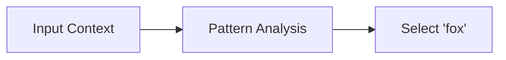
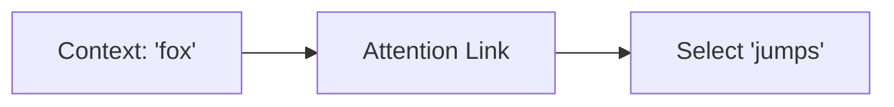

# Understanding LLM Processing: From "the quick fox jumps" to "fox jumps"

A deep dive into how Large Language Models process and generate text, demonstrated through a simple example.

## 🔄 Input Processing

The transformer begins by processing the raw input text:

```text
Input: "the quick fox jumps"
↓
Tokenization & Embedding
↓
Sequence: ["the", "quick", "fox", "jumps"]
```

## 🎯 Attention Mechanism

### Fox's Attention Pattern
| Token    | Attention Score | Relationship    |
|----------|----------------|-----------------|
| fox      | HIGH           | Self-reference  |
| jumps    | HIGH           | Action link     |
| quick    | MEDIUM         | Modifier        |
| the      | LOW            | Article         |

### Jumps's Attention Pattern
| Token    | Attention Score | Relationship    |
|----------|----------------|-----------------|
| fox      | VERY HIGH      | Subject         |
| jumps    | HIGH           | Self-reference  |
| quick    | LOW            | Indirect        |
| the      | LOW            | Indirect        |

## 🧠 Pattern Recognition

The model identifies the essential components:

- **Core Action**: "fox jumps"
  - Subject: "fox" (noun)
  - Action: "jumps" (verb)
  - Optional: "the", "quick" (modifiers)

## ⚙️ Generation Process

### Step 1: First Token

- Analyzes full context
- Identifies main subject
- Generates: "fox"

### Step 2: Second Token

- Uses "fox" as context
- Follows strong attention link
- Generates: "jumps"

## 🎯 Modifier Elimination

The model strategically removes non-essential elements:

| Element   | Type        | Status    | Reason                     |
|-----------|-------------|-----------|----------------------------|
| "the"     | Article     | Dropped   | Optional in summaries      |
| "quick"   | Adjective   | Dropped   | Non-essential modifier     |
| "fox"     | Subject     | Kept      | Core meaning component     |
| "jumps"   | Verb        | Kept      | Core action component      |

## 🔑 Key Processing Factors

1. **Position Encoding**
   - Maintains sequence understanding
   - Preserves word order importance

2. **Attention Weights**
   - Maps token relationships
   - Identifies critical connections

3. **Training Patterns**
   - Learns information hierarchy
   - Distinguishes core vs. optional elements

4. **Language Understanding**
   - Recognizes grammatical structures
   - Maintains semantic coherence

---

*This document explains the simplified process of how a transformer-based language model processes and generates text, using a specific example for illustration.*